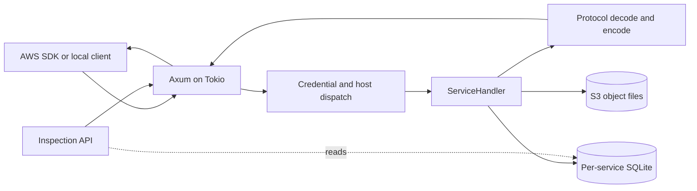

# Architecture

Roto is one Rust process with a single HTTP endpoint and a set of in-process AWS
service handlers. It uses Axum for HTTP routing, Tokio for asynchronous I/O, and
SQLite for persistent resource state. Service handlers use Diesel for typed SQL
queries. Large S3 object bodies are stored as files rather than SQLite blobs.

## Technology and crate map

| Part | Technology | Role in Roto |
| --- | --- | --- |
| HTTP server | Axum 0.8, running on Tokio 1 | Accepts AWS SDK requests and serves the inspection API. Axum uses Hyper underneath. |
| Async runtime | Tokio | Owns the listener and background tasks. Synchronous service and SQLite work runs on Tokio's blocking pool. |
| Relational storage | SQLite, accessed by Diesel 2.3 | Stores service resources in a separate database per service. `rusqlite` remains in the core storage layer for migrations and inspection. |
| Object storage | Local filesystem | Stores S3 object bodies; SQLite stores their metadata and paths. |
| AWS protocol types | `roto-protocol` | Shared encoders and decoders for AWS JSON, Query/XML, and REST-XML formats. |
| Generated bindings | `roto-codegen` and botocore service models | Produces operation types, serialization, and route tables checked into service crates. |
| CLI and logs | Clap and `tracing` | Configures the server and reports requests and runtime events. |

The crate boundaries follow those responsibilities:

| Crate | Responsibility |
| --- | --- |
| `roto-server` | CLI, Axum router, request dispatch, server-wide state, inspection endpoints, tracing, and service startup. |
| `roto-core` | The `ServiceHandler` interface, request context, errors, credential-scope parsing, IDs, and SQLite storage. |
| `roto-protocol` | Shared protocol parsing and serialization. |
| `roto-codegen` | Converts botocore service models into Rust service bindings. |
| `roto-svc-*` | AWS service behavior, schemas, migrations, and service-specific protocol bindings. |

The server currently wires handlers for CloudFormation, DynamoDB, EventBridge,
IAM, Kinesis, KMS, Lambda, S3, Secrets Manager, SNS, SQS, SSM, and STS. A shared
in-memory WebSocket hub handles IoT topic fan-out and API Gateway management
callbacks to connected local clients.

## Request path

The server registers explicit Axum routes for its inspection and reset APIs. The
router's fallback receives AWS API calls and the local `/roto-http/` gateway.
For an AWS call, the server reads the HTTP request into the protocol-neutral
`RawRequest`, then selects a handler using the service in the SigV4 credential
scope, with the host name as a fallback. Unsigned calls can be claimed by a
handler. The parsed credential scope supplies the region; IAM and STS handlers
can map issued access keys to an account.

Credential parsing is for routing and account selection. Roto does not verify
SigV4 signatures or enforce IAM policies, bucket policies, ACLs, or trust
policies.

Each handler implements `ServiceHandler`: it decodes its wire protocol, applies
service behavior, accesses its store, and returns a protocol response. The
server runs this synchronous work on Tokio's blocking pool, then converts the
raw response into HTTP. Shared response handling applies HTTP status and
transport behavior uniformly across AWS services.



AWS Query/XML is used by STS, IAM, SNS, and CloudFormation. AWS JSON protocols
are used by services including SQS. S3 uses REST-XML routes. Botocore's
`models/<service>/service-2.json` definitions feed the generator; edit the
generator and regenerate bindings instead of hand-editing `generated.rs` files.
Service behavior and compatibility details remain ordinary Rust code.

## Botocore models and Rust code generation

Botocore is the Python AWS SDK component that knows how each AWS API is shaped
on the wire. Its `service-2.json` model describes a service's identity and
protocol, the available operation names, each operation's input and output
shapes, and the shapes' members, types, required fields, and wire names. REST
models also describe HTTP methods, URI templates, and whether members belong in
the URI, query string, headers, or body. For example, the SQS `SendMessage`
operation points to `SendMessageRequest` and `SendMessageResult` shapes and has
a `POST /` HTTP binding. Botocore uses this metadata to construct SDK clients
and serialize their calls; the model describes the API contract, not AWS's
business logic or stored state.

Roto keeps model files under `models/` and reads them with its Rust
`roto-codegen` program. The generator follows operation references into their
input and output shapes, maps supported shape types to Rust types, and emits a
`generated.rs` module in the corresponding service crate. Depending on the
declared protocol, that module contains request and response structs,
serialization and parsing code, operation dispatch, and the service trait that
the handwritten handler implements. REST-JSON and REST-XML generation also
build route tables from the model's HTTP bindings. Protocol helpers live in
`roto-protocol` and are called by the generated code.

Regenerate every service's checked-in bindings after changing a model or the
generator:

```sh
scripts/gen.sh
```

That script runs `roto-codegen` once for each service model and formats the
result. The server compiles the checked-in Rust modules; it does not need to
load the model JSON or run Python botocore at runtime.

The generated `OPERATIONS` table reports whether the generator can represent
an operation's request and response shapes. A `true` entry means its codec and
dispatcher were generated; it does not mean Roto has implemented the AWS
operation's behavior. The generated service trait provides default
`NotImplemented` methods, and service crates add behavior in hand-written Rust.
Some model features are outside the generator's supported shape subset and
cause the corresponding generated operation to remain unsupported. API model
updates can therefore add types and routes automatically, while behavioral
compatibility still requires service code and tests.

## State and transactions

Persistent mode creates a `{service}.db` SQLite file for each service in the
data directory. Each service applies its ordered SQL migrations when its store
is opened. SQLite runs in WAL mode with foreign keys enabled; normal mode uses
`synchronous=NORMAL`, while `--durable` switches to `FULL`. The current store
serializes access to each service database rather than using a connection pool.
`--ephemeral` uses in-memory SQLite databases and temporary directories for
object bodies.

Service handlers use Diesel's typed ORM/query API and SQLite connection. The core
storage layer also uses `rusqlite` to apply migrations and to support the
inspection API's existing read path. The two connections for a service share
the storage lock, so inspection and service transactions are serialized.

S3 object bodies live under the data directory in persistent mode; SQLite holds
the bucket, object-version, upload, and file-path metadata. This keeps large
payloads out of the relational database. Restarting a persistent server
preserves both the metadata and object files.

Each service operation generally commits or rolls back its own SQLite
transaction. Cross-service workflows compose existing handlers in-process:
for example, CloudFormation creates resources by calling their service
handlers, and SNS/EventBridge/S3 notifications can dispatch to queues or
Lambda. Those workflows are not a distributed transaction. CloudFormation
stack metadata is stored separately from resource state, so a multi-resource
update can partially apply; rollback is a best-effort reconciliation and
cannot restore resource data that was deleted.

## Background work and inspection

The Tokio runtime also starts background workers for Lambda invocations,
EventBridge deliveries, and S3 notification retries. These workers call service
logic in-process and use the same persistent stores as API requests.

The `/roto-api/` inspection UI and its JSON endpoints share the server and
stores but are not AWS APIs. They expose resource records, request history,
unsupported calls, and selected delivery or invocation history. Request traces
record metadata such as operation, account, region, result, and duration; they
omit credentials, headers, query strings, and request/response bodies.

See [Server reference](server.md) for listener options and inspection endpoints,
[Storage](storage.md) for persistence details, and [Service coverage](services.md)
for the current implementation baseline.
